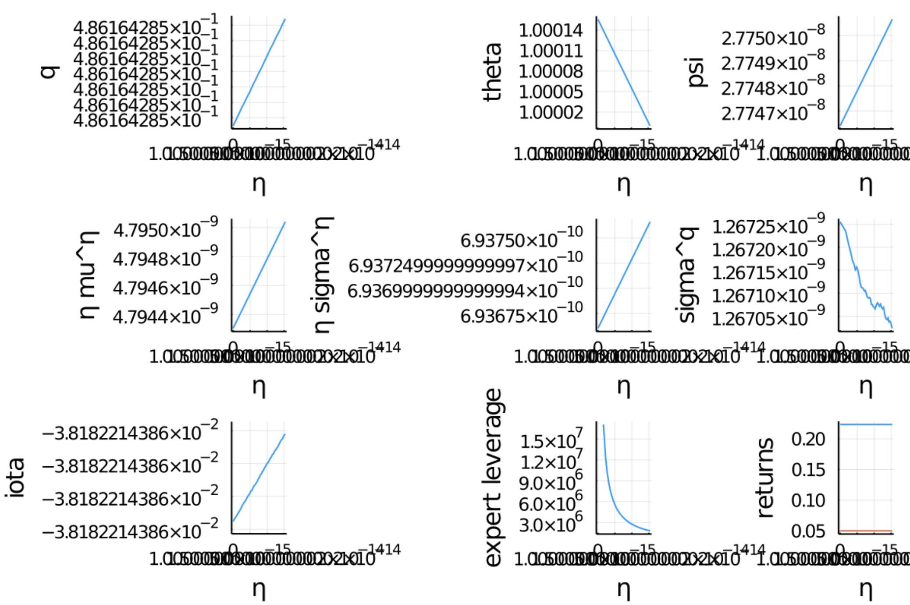
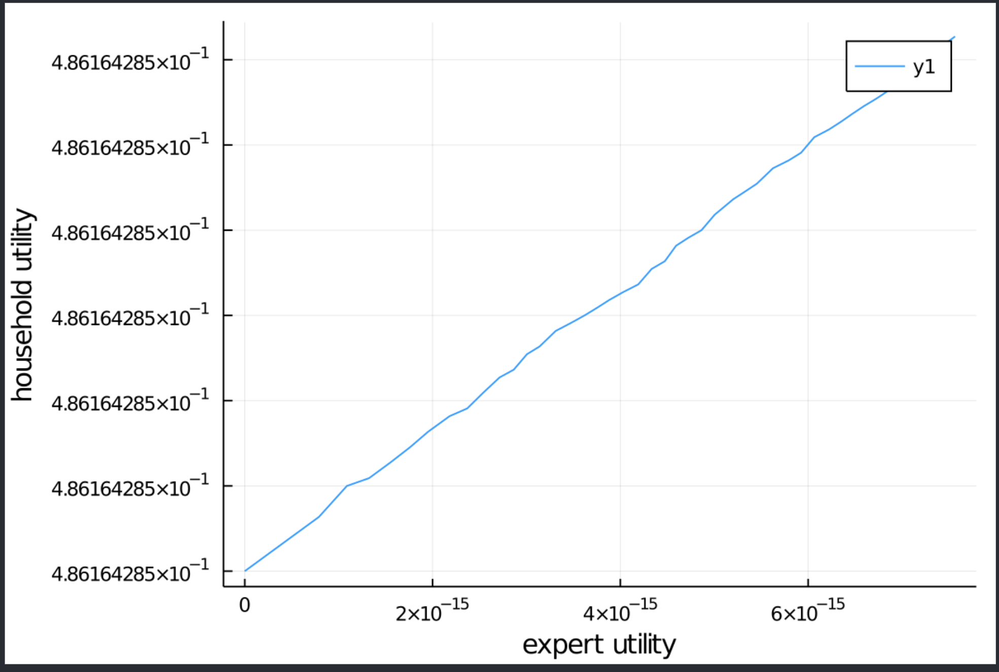

# Brunnermeier_Sannikov_Replication.jl

## The paper

The paper “A Macroeconomic Model with a Financial Sector”, written by Markus K. Brunnermeier and Yuliy Sannikov and published in 2014 in the American Economic Review, analyses the full equilibrium dynamics of an economy with financial frictions. It can be found here (https://www.aeaweb.org/articles?id=10.1257/aer.104.2.379). The model allows for an explicit distinction between exogenous and endogenous risk. In times of crises, endogenous risk persists even for very low levels of exogenous risk, a feature which resolves the Kocherlakota (2000) critique. Building on the seminal contributions of Kiyotaki and Moore (1997) and Bernanke, Gertler and Gilchrist (1999), the core of the model features 2 types of agents: productive experts and less productive households. Because of financial frictions, the evolution of the wealth distribution between the 2 agents will play a crucial role when analysing normal and times of crises. During the latter, the model’s equilibrium dynamics derive a number of important implications, with highly nonlinear and asymmetric reactions, endogenous risk dominating volatility dynamics and a potential trap of the system into a recession among the most important ones.  

## The original code 

The replication material can be found here https://www.openicpsr.org/openicpsr/project/112732/version/V1/view?path=/openicpsr/112732/fcr:versions/V1/data&type=folder. The code was written in Matlab. 3 among the 4 files set up the equations, the last file solves for the equilibrium and produces the plots. 

## What we did 

Our goal was to replicate the results in the programming language Julia. Precisely, we wanted to produce the same graphs as in the paper. These graphs show the full equilibrium dynamics of the model, where ultimately every dynamic can be regarded as depending on eta, the share of wealth held by households. For that, we followed the same steps as in the original Matlab code, which basically consisted of 5 steps: Setting up a first function calculating the optimal investment rate given the overall price level, a second function calculating the vector of partial derivatives as well as the dynamic parameters, 2 third functions calculating the worst and best allocation of ressources (that’s wrong don’t know what to write), solving for the equilibrium and plotting the results. The biggest discrepancy we encountered between the 2 languages consisted of the way the model was solved. Such models can be solved through so-called ODEs (ordinary differential equations). In order for the solver to achieve a successful integration, we set up our ODE problem following the common 4 ingredients you need to do so in Julia: The ODEs itself, which consist of equations describing the way the variable you want to analyse evolves. In our case, they consist of partial derivatives of functions describing how certain variables evolve with respect to eta, the share of wealth held by households. The basic idea is to recover precisely these functions by only providing their partial derivatives. In order for the solver to achieve this goal, you need to supplement these ODEs with the 3 other ingredients: The parameters of the model, the dependent variable (again, in our case this is eta) and the initial value of the problem, which initializes the starting value. 

## Our problems 

Our only problem consisted of solving for the equilibrium. Setting up all functions and plotting the result did not prove to be a huge obstacle. However, we struggled a lot with the part that solves for the equilibrium. Prior to solving for the equilibrium, we checked every line several times and we are confident in having correctly replicated all ingredients the solver needs to solve for the equilibrium. Even though the solver ultimately achieves to solve for an equilibrium, it does not correspond to the one in the paper. This can be seen by comparing our graphs to the ones of the paper. Ours depart in a systemic way from the ones presented in the paper. We tried out several things and reached out to the online community, but in the end, we were not able to replicate the results and we do not really know why. However, our replication can serve as a solid base on which future students or researchers can build on. We do believe that the problem lies somewhere in …
